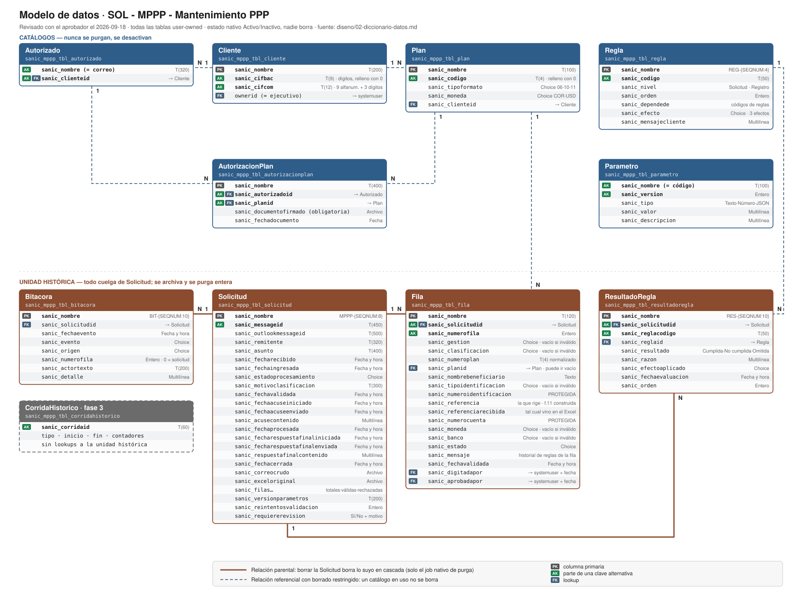

# 02. Diccionario de datos

Proyecto: 2026-001-referencias-planes-pago · Etapa 3 · Estado: **revisado con el aprobador el 2026-09-18**; lo que sigue abierto está en `PENDIENTES.md`.

Convenciones en `01-convenciones.md` (estándar BP-PP-181 a BP-PP-195). Tipos: `T(n)` texto de n caracteres · `M(n)` multilínea · `E` entero · `F` fecha y hora (Usuario local) · `B` sí/no · `C:<choice>` choice global · `L:<tabla>` lookup · `A` archivo. **Req**: `S` = requerido por negocio, vacío = opcional. **Seg**: columna con seguridad de columna (RNF-04, BP-PP-004).

**Todas las tablas son user-owned** (BP-PP-013). **Ninguna tabla tiene un sí/no propio de activo**: se usa el estado nativo Activo/Inactivo de Dataverse. Nadie borra: los catálogos se desactivan.

## Diagrama del modelo

Se **genera**, no se dibuja a mano: `python3 herramientas/generar_er.py`. Cuando cambia este diccionario, se actualiza el modelo declarado en ese script y se regenera.

## 0. Decisiones de este documento

| ID | Decisión | Motivo |
|---|---|---|
| DD-01 | **La Fila guarda solo valores válidos en los campos de lista.** Gestión, Clasificación, Moneda, Tipo de identificación y Banco son **choices** (decisión del aprobador: todas las listas se tratan igual). Si el cliente mandó un valor inválido, la columna queda vacía y el motivo —con el valor recibido— va en `sanic_mensaje`. Los campos de texto libre se guardan como llegaron, recortados al largo de la columna. | Decisión del aprobador: un valor inválido no sirve para nada guardado, y la evidencia de lo que mandó el cliente no se pierde porque el Excel original está en la Solicitud. Reemplaza al diseño anterior de texto crudo más columnas normalizadas. |
| DD-02 | La configuración de plantilla, listas permitidas y obligatoriedad vive como **JSON versionado en filas de Parametro**, con códigos separados por puntos (`plantilla.estructura`). | RF-05. Una versión de plantilla tiene que cambiar toda junta o no cambiar: con 50 parámetros sueltos, a mitad de una edición la ingesta leería media plantilla nueva y media vieja. Quien la edita es el Administrador técnico, un desarrollador a pedido (D-38). |
| DD-03 | La clave de Solicitud es `sanic_messageid` `T(450)`, **un solo campo**. `MPPP-ING` recorta a 450 si alguna vez se excede. | 450 caracteres es el máximo que admite una clave (900 bytes, verificado en Learn). En la práctica Exchange y Gmail generan entre 60 y 120. Con `< > + /` en el valor la clave sirve para **unicidad**, no para GET/PATCH: **prohibido** hacer upsert por clave en `MPPP-ING`. El spike registra el largo real de los Message-ID del buzón. |
| DD-04 | La Bitácora **no tiene clave alternativa**. Excepción declarada a RNF-08. | No tiene clave de negocio natural, y la reactivación conserva los GUID (D-36): una clave hecha de un GUID en texto no agrega nada. |
| DD-05 | Todas las tablas son user-owned, incluidos los catálogos. Excepción declarada a `definicion.md` §6 "Datos" y a BP-PP-001. | BP-PP-013 (estándar del estudio). La propiedad es **irreversible**: user-owned deja abierta la separación por persona o unidad de negocio; org-owned la cierra para siempre. Precisión: org-owned no significa "cualquiera la ve", significa "quien tiene el privilegio ve todas las filas"; quien no tiene un rol `SR - MPPP` no ve nada en ningún caso. |
| DD-06 | Un correo no reconocido que el ejecutivo decide ignorar se marca **Descartada**. No hay borrado humano. | `definicion.md` §6 "Seguridad". Lo purga el plazo corto `retencion.dias.noreconocidas` (D-28). |
| DD-07 | El supervisor puede **devolver** una fila: Digitada → Validada, con motivo obligatorio. | Confirmado por el aprobador: pasa en la operación real. Sin camino de vuelta, un error de digitación deja la fila trabada y la solicitud nunca se cierra. |
| DD-08 | **Dos comunicaciones al cliente**, cada una como máximo una vez: (1) **acuse** inmediato con el resultado de la validación fila por fila; (2) **respuesta final** cuando todas las filas terminaron, con lo que se hizo en AS400, lo que no y por qué. El cuerpo de ambas lo arma el código y se guarda en la Solicitud; `MPPP-ENV` solo envía. Nunca se devuelven identificación ni cuenta completas: la cuenta va enmascarada a 4 dígitos. | Precisión del aprobador a RF-09 y D-21, que describían una sola comunicación. Cierra el hueco de que el cliente nunca se enteraba del resultado final. |
| DD-09 | Si **ninguna fila es válida** (o falla una regla de solicitud), la Solicitud queda **Rechazada** y recibe **una única comunicación**, que lo dice expresamente: "no hay nada que procesar, no recibirá otro correo por esta solicitud; corrija y reenvíe". | No habrá respuesta final porque no hay nada que digitar; el cliente no puede quedarse esperándola. |
| DD-10 | En planes con **tipo de formato 11**, la Referencia **se construye**: código de banco (3 dígitos) + ceros + número de cuenta, hasta 20 caracteres. Para armarla se ignora lo que venga en la columna Referencia de la plantilla, que igual se conserva aparte en `sanic_referenciarecibida`. El código del banco no se guarda en la Fila: sale de la equivalencia banco → código de 3 dígitos de `plantilla.listas`. | Regla de negocio informada por el aprobador el 2026-09-18. Las preguntas que abre están en `PENDIENTES.md`. |
| DD-11 | El estado del correo de un desconocido se llama **No reconocida**, y el efecto de regla que lo produce, **Envía a revisión**. | Al aprobador "Derivada" no le decía nada; "No reconocido" es el término de la propia definición (RF-03). "Envía a revisión" dice lo que pasa: no se le responde al cliente y un ejecutivo la revisa. |
| DD-12 | **No se validan duplicados dentro de una plantilla** (mismo plan y misma referencia dos veces, o inclusión y exclusión de la misma persona). Las dos filas pasan como Validada. | Decisión del aprobador: el control está en AS400, que rechaza la segunda. Esa fila termina anulada por quien digita, con el motivo de AS400. |
| DD-13 | **Las reglas tienen orden y dependencias.** Cada regla del catálogo declara de qué otras depende. Si una regla falla, las que dependen de ella **no se evalúan**. Aplica a los dos niveles. En las **reglas de solicitud** —el sobre, el correo— cada regla deja su registro en `ResultadoRegla`, y las no evaluadas quedan como **Omitidas** con la regla que las bloqueó: ese es el historial. En las **reglas de registro** las dependencias solo evitan evaluar lo que no tiene sentido; la fila guarda los motivos de lo que falló, sin historial por regla. "El plan existe" es una regla más (`PLAN_EXISTE`), no un caso especial del código. | Decisión del aprobador. Reemplaza dos parches del diseño anterior: el "No evaluable" de las reglas de solicitud y el tratamiento especial de la fila sin plan. Un resultado tiene ahora tres valores: Cumplida, No cumplida, Omitida. |
| DD-14 | **Rechazada en AS400 y Anulada son dos finales distintos.** *Rechazada en AS400*: AS400 no aceptó la operación por una condición suya (la moneda de la cuenta no coincide con el plan, el nombre no se parece al titular, el plan o la cuenta están inactivos, la referencia ya existe). La reporta quien digita: el ejecutivo o el RPA. *Anulada*: decisión de un **ejecutivo** de dar de baja una fila que está mal y no se puede componer, típicamente después de una devolución del supervisor; al cliente se le pide que la reenvíe. El RPA nunca anula. El supervisor **solo aprueba o devuelve**. Las dos llevan motivo obligatorio y las dos se le comunican al cliente en la respuesta final. | Decisión del aprobador. |
| DD-15 | **Solo en formato 11 la solución decide la Referencia** (la construye, DD-10). En los formatos **06** y **10** la solución **no deriva nada**: guarda la recibida, que puede venir vacía, y quien digita —la persona o el RPA— aplica la convención del negocio (en 06 normalmente la identificación, en 10 normalmente la cuenta o la cédula, salvo que el cliente especifique otra). Una vez incluida, **la referencia no se puede cambiar**: una Modificación cambia la cuenta y los datos internos, nunca la referencia. | Decisión del aprobador: esas convenciones tienen excepciones y las aplica quien opera AS400; codificarlas acá sería inventar una regla que el negocio no tiene escrita. En formato 11 la referencia sale de banco + cuenta, así que ahí **cambiar la cuenta no es una Modificación: es una Exclusión más una Inclusión**. La solución no puede detectarlo (no ve el core); si llega como Modificación, AS400 no encuentra la referencia y la fila termina Rechazada en AS400. |
| DD-16 | **Matriz de obligatoriedad inicial: todas las columnas son obligatorias** en las nueve combinaciones de Gestión × Clasificación, **salvo Referencia**, que se rige por DD-15. Incluye cheque (CK): también trae cuenta, moneda y banco. | Decisión del aprobador: se arranca estricto y se flexibiliza después, cambiando el parámetro `plantilla.obligatoriedad`, sin tocar código. Mientras rija, queda sin efecto la parte de RF-06 que dice que en una Modificación los campos vacíos significan "sin cambio": hoy una Modificación trae todos los campos con su valor nuevo. |
| DD-17 | **Un plan formato 11 solo admite clasificación ACH** (regla `FORMATO_11_SOLO_ACH`). | Regla de negocio informada por el aprobador. |
| DD-18 | **Auditoría nativa activada en los catálogos** (Cliente, Plan, Autorizado, AutorizacionPlan, Parametro, Regla), tabla y columnas; **desactivada en la unidad histórica** (Solicitud, Fila, ResultadoRegla, Bitacora). **Notas y actividades desactivadas en todas.** | Aprobado por el aprobador el 2026-09-20. En un banco importa quién cambió un CIF, una autorización o un parámetro, y los catálogos tienen poco volumen. La unidad histórica ya lleva su trazabilidad en columnas propias y en la Bitácora (D-06), y su volumen es alto. La auditoría solo registra si además está activada a nivel de entorno. Notas y actividades se pueden activar después; desactivarlas, no. |
| DD-19 | **El nombre visible de cada columna se fija en el playbook de su tabla** (`playbooks/tabla/`), no acá. | Este diccionario define nombres lógicos, tipos y reglas. El nombre visible es texto de negocio que se puede cambiar después sin romper nada; el nombre lógico, no. |
| DD-20 | **Las primarias de Regla, ResultadoRegla y Bitácora son autonuméricas y opcionales**: `REG-{SEQNUM:4}`, `RES-{SEQNUM:10}` y `BIT-{SEQNUM:10}`. Se llenan solas; nadie las digita ni las calcula. | Decisión del aprobador (2026-09-20), al cerrar D-4 y D-5. Cumple BP-PP-192 (la primaria nunca es texto libre) sin un plugin más: en esas tres tablas el nombre tiene poca relevancia (`01` §4), y lo que identifica al registro es otra cosa (el código de la regla; la solicitud y el código de regla; la solicitud y la fecha del evento). Bitácora deja de necesitar el step de nombre calculado. |

## 1. Choices globales

Valor = correlativo estable (ver `01` §6). `T` = estado terminal.

| Choice | Opciones |
|---|---|
| `sanic_mppp_ch_moneda` | 1 COR · 2 USD |
| `sanic_mppp_ch_gestion` | 1 Inclusión · 2 Exclusión · 3 Modificación |
| `sanic_mppp_ch_clasificacion` | 1 BAC · 2 ACH · 3 CK |
| `sanic_mppp_ch_tipoformatoplan` | 1 `06` · 2 `10` · 3 `11` |
| `sanic_mppp_ch_tipoidentificacion` | 1 CNA · 2 CRE · 3 PAS · 4 PEX · 5 RUC |
| `sanic_mppp_ch_banco` | 1 LAFISE · 2 BAC · 3 BANPRO · 4 FICOHSA · 5 BDF · 6 AVANZ · 7 PRODUZCAMOS · 8 ATLANTIDA |
| `sanic_mppp_ch_estadosolicitud` | 1 Ingresada · 2 No reconocida · 3 Descartada `T` · 4 Rechazada · 5 En proceso · 6 Procesada · 7 Cerrada `T` · 8 No es correo nuevo · 9 Vencida `T` |
| `sanic_mppp_ch_estadofila` | 1 Rechazada en validación `T` · 2 Sin autorización `T` · 3 Validada · 4 Digitada · 5 Aprobada `T` · 6 Rechazada en AS400 `T` · 7 Anulada `T` |
| `sanic_mppp_ch_efectoregla` | 1 Rechaza · 2 Envía a revisión · 3 Advierte |
| `sanic_mppp_ch_nivelregla` | 1 Solicitud · 2 Registro · 3 Correo |
| `sanic_mppp_ch_resultadoregla` | 1 Cumplida · 2 No cumplida · 3 Omitida |
| `sanic_mppp_ch_origenevento` | 1 MPPP-REC · 2 MPPP-ING · 3 MPPP-COM · 4 MPPP-ENV · 5 MPPP-VIG · 6 Custom API · 7 Plugin · 8 App |
| `sanic_mppp_ch_eventobitacora` | 1 Ingresada · 2 Validación terminada · 3 Acuse iniciado · 4 Acuse enviado · 5 Fila digitada · 6 Fila aprobada · 7 Fila devuelta · 8 Fila rechazada en AS400 · 18 Fila anulada · 9 Procesada · 10 Respuesta final iniciada · 11 Respuesta final enviada · 12 Cerrada · 13 No reconocida atendida · 14 Descartada · 15 Reintento · 16 Requiere revisión · 17 Error · 19 Correo clasificado · 20 Vencida |
| `sanic_mppp_ch_tipoparametro` | 1 Texto · 2 Número · 3 JSON |

**Estados de la Solicitud**: *Ingresada* (llegó, sin clasificar ni validar) · *No es correo nuevo* (es una respuesta a otro correo, o no se pudo leer; no se procesa ni se responde, `07` DF-08) · *No reconocida* (remitente sin autorización sobre ningún plan; no se responde) — las dos van a la bandeja **Por clasificar**, donde un ejecutivo las atiende o las descarta · *Vencida* (nadie la clasificó en `clasificacion.dias.vencimiento` días) · *Descartada* (el ejecutivo decidió ignorarla) · *Rechazada* (nada que procesar; una única comunicación, DD-09) · *En proceso* (hay filas válidas; acuse enviado o por enviarse) · *Procesada* (todas las filas terminaron; dispara la respuesta final) · *Cerrada* (respuesta final enviada, o Rechazada ya comunicada, o No reconocida atendida). **Cerrada marca el fin del tiempo de ciclo** (criterio de éxito 1) y el inicio del plazo de retención.

**El RPA no es un estado, es un actor**: cuando digite y apruebe, la fila pasa por Digitada y Aprobada igual que con una persona, con el usuario de aplicación del RPA en `sanic_digitadapor` y `sanic_aprobadapor`.

**Efecto de regla**: qué le pasa a la Solicitud cuando esa regla de solicitud falla. *Rechaza*: en una regla de solicitud, se le responde al cliente con el motivo; en una de registro, se rechaza esa fila. *Envía a revisión*: válido en las reglas del sobre —niveles Correo y Solicitud— y nunca en Registro; no se responde, queda No reconocida y la revisa un ejecutivo (D-20). *Advierte*: se registra y el proceso sigue.

**Banco y tipo de identificación como choice**: agregar un banco nuevo exige desplegar una versión de la solución, además de agregarlo con su código en `plantilla.listas`. Es el costo aceptado de tratar todas las listas igual.

**Origen del evento**: qué pieza escribió el renglón de bitácora; sirve para diagnosticar. Las opciones de RPA e Histórico se agregan en sus fases.

## 2. Catálogos (nunca se purgan; se desactivan — RNF-08)

### 2.1 `sanic_mppp_tbl_cliente` (Owner = ejecutivo asignado, RF-19, D-23)
| Columna | Tipo | Req | Nota |
|---|---|---|---|
| `sanic_nombre` | T(200) | S | Razón social. Columna primaria. |
| `sanic_cifbac` | T(9) | S | **Clave** `sanic_mppp_key_cliente_cifbac`. Solo dígitos; se guarda **rellenado con ceros a la izquierda hasta 9**. Formato final `^\d{9}$`. |
| `sanic_cifcom` | T(12) | S | **Clave** `sanic_mppp_key_cliente_cifcom`. 9 caracteres alfanuméricos o espacio + 3 dígitos, todo en mayúscula: `^[A-Z0-9 ]{9}\d{3}$`. |
| `ownerid` | sistema | S | Ejecutivo asignado. Lo cambia solo el Administrador de planes. |

Todo cliente tiene siempre los dos CIF (confirmado). Un plugin PreOperation normaliza (mayúscula, relleno) y valida el formato al crear y al modificar.

### 2.2 `sanic_mppp_tbl_plan` (MaestroPlanes, RF-12, D-20)
| Columna | Tipo | Req | Nota |
|---|---|---|---|
| `sanic_nombre` | T(100) | S | Primaria calculada: `<codigo> - <cliente>`. |
| `sanic_codigo` | T(4) | S | **Clave** `sanic_mppp_key_plan_codigo`. **Único en todo el banco.** Alfanumérico, en mayúscula, rellenado con ceros a la izquierda hasta 4: `^[A-Z0-9]{4}$`. |
| `sanic_tipoformato` | C:tipoformatoplan | S | `06`, `10` u `11`. Gobierna cómo se arma la Referencia (DD-10). |
| `sanic_moneda` | C:moneda | S | RF-07. |
| `sanic_clienteid` | L:cliente | S | Borrado restringido. Un plan es de una sola empresa. |

La validación normaliza lo que escribe el cliente antes de buscar el plan: `12` → `0012`, `a1` → `00A1`.

### 2.3 `sanic_mppp_tbl_autorizado` (RF-11, D-27)
| Columna | Tipo | Req | Nota |
|---|---|---|---|
| `sanic_nombre` | T(320) | S | **Es el correo** (BP-PP-192: la columna primaria es la clave de negocio validada). Guardado sin espacios y en minúscula. La clave no distingue mayúsculas de todos modos (verificado en el spike C-05 parte B: `ABC` y `abc` chocan). |
| `sanic_clienteid` | L:cliente | S | Borrado restringido. **Clave** `sanic_mppp_key_autorizado_cliente_nombre` = cliente + correo. |

Un mismo correo puede estar bajo varias empresas: la vista de búsqueda muestra también la columna Cliente para distinguir los renglones.

### 2.4 `sanic_mppp_tbl_autorizacionplan` (RF-02)
Resuelve la relación N:N entre correos autorizados y planes. Es una tabla y no una N:N nativa para poder desactivar una autorización puntual sin tocar las demás.

| Columna | Tipo | Req | Nota |
|---|---|---|---|
| `sanic_nombre` | T(400) | S | Primaria calculada: `<correo> → <plan>`. |
| `sanic_autorizadoid` | L:autorizado | S | Borrado restringido. |
| `sanic_planid` | L:plan | S | Borrado restringido. **Clave** `sanic_mppp_key_autorizacionplan_autorizado_plan`. |
| `sanic_documentofirmado` | A (10 MB) | S* | **Evidencia de ESTA autorización** (RF-11, D-08, excepción E-17): el documento firmado que respalda que este correo opere sobre este plan. Una por cada par correo → plan (decisión del aprobador, 2026-09-20). |
| `sanic_fechadocumento` | F (solo fecha) | | Fecha del documento firmado. |

Regla de integridad (plugin PreOperation, BP-PP-051): el cliente del plan debe ser el cliente del autorizado. **Autorización vigente** (definición única; la usan `REMITENTE_RECONOCIDO` y `AUTORIZACION_CORREO_PLAN`, `03` §0 y §1): están **activos** el Autorizado, el Plan, el Cliente y la propia AutorizacionPlan, **y la AutorizacionPlan tiene su evidencia cargada** (`sanic_documentofirmado` con archivo).

\* **Por qué "obligatoria" no es "requerida al crear".** Una columna de archivo de Dataverse solo acepta el archivo después de que el registro existe (verificado en Learn, 2026-09-20), así que no se puede exigir en el alta. La obligatoriedad se cumple **cerrando por defecto**: una autorización nace sin evidencia y **no vale** hasta que se le carga; si se le quita el archivo, deja de valer en ese mismo momento. No hay forma de que una fila se valide contra una autorización sin documento. La app lo hace visible: vista "Autorizaciones sin evidencia" y la marca en cada subgrilla (`05`). A verificar al construir: que la condición "columna de archivo con valor" se pueda consultar con `not-null` desde el plugin (la columna guarda el identificador del archivo).

### 2.5 `sanic_mppp_tbl_parametro` (RF-05, DD-02, D-38)
| Columna | Tipo | Req | Nota |
|---|---|---|---|
| `sanic_nombre` | T(100) | S | **Es el código**, en minúscula y separado por puntos: `tipo.parametro.subparametro`. **Clave** `sanic_mppp_key_parametro_nombre_version` = nombre + versión. |
| `sanic_version` | E | S | Rige la versión **activa** más alta. Cambiar = crear una versión nueva y desactivar la anterior; nunca se edita la vigente, para que `sanic_versionparametros` de cada Solicitud siga diciendo la verdad. |
| `sanic_tipo` | C:tipoparametro | S | |
| `sanic_valor` | M(100000) | S | |
| `sanic_descripcion` | M(2000) | | |

| Código | Tipo | Contenido |
|---|---|---|
| `plantilla.estructura` | JSON | **La ventana de lectura** (LP-04): hoja `Datos`, fila de encabezado 12, primera fila de datos 13, cantidad de filas (100); y por cada campo: en qué columna está, encabezado esperado, largo mínimo y máximo, formato. El lector no mira nada fuera de esa ventana. El `formato` de cada campo es una lista **cerrada**: `texto`, `digitos`, `alfanumerico`, más `largoMinimo` y `largoMaximo`; sin expresiones regulares (D-18) |
| `plantilla.listas` | JSON | Valores aceptados de Gestión, Clasificación, Tipo de identificación, Moneda y Banco, con sus variantes de escritura; **cada banco con su código de 3 dígitos** (DD-10). La comparación de un valor contra estos valores **no distingue mayúsculas, tildes ni espacios al inicio y al final**; las variantes de escritura son explícitas en el parámetro (D-18) |
| `plantilla.obligatoriedad` | JSON | Campos obligatorios por Gestión × Clasificación × tipo de formato del plan. **Versión inicial: todos obligatorios salvo Referencia** (DD-16). Se expresa como una **lista de excepciones sobre un valor por defecto** (D-18) |
| `lectura.limites` | JSON | Peso máximo del archivo comprimido y peso máximo descomprimido (LP-02, LP-03) |
| `retencion.dias.general` · `retencion.dias.noreconocidas` | Número | Plazos del histórico (fase 3) |
| `vigilancia.minutos.sinvalidar` · `vigilancia.minutos.sinresponder` · `vigilancia.reintentos.maximo` | Número | `MPPP-VIG` |
| `correo.prefijos.reenvio` | JSON | Prefijos de asunto que identifican un reenvío: `FW:`, `FWD:`, `RV:`, `REENV:` (`03` §0) |
| `clasificacion.dias.vencimiento` | Número | Días que un correo puede quedar en Por clasificar antes de pasar a Vencida. Inicial: 30 |
| `rpa.puedeaprobar` | Texto | `no` hasta contar con el aval de C-03. En `si`, el bot puede aprobar lo que él mismo digitó, siempre como evento aparte (`03` §3) |

**Las tres formas de D-18** (ejemplos tal cual figuran en `PENDIENTES.md`):
- `plantilla.listas`: comparación sin mayúsculas, tildes ni espacios a los lados, con variantes explícitas por valor: `{"gestion":[{"valor":"Inclusion","variantes":["inclusión","alta"]}]}`.
- `plantilla.estructura` (`formato`): lista corta y cerrada — `texto`, `digitos`, `alfanumerico` — más `largoMinimo` y `largoMaximo`; nada de expresiones regulares en un parámetro.
- `plantilla.obligatoriedad`: lista de excepciones sobre un valor por defecto: `{"porDefecto":"obligatorio","opcionales":[{"campo":"referencia"}],"reglas":[{"gestion":"Exclusion","clasificacion":"*","formato":"*","opcionales":["moneda","banco"]}]}`; arranca con todo obligatorio salvo Referencia (DD-16) y crece cuando el negocio escriba la matriz.

Largos de la plantilla vigente (ficha §9): Nombre ≤44 · Identificación 1–16 · Referencia ≤20 · Cuenta 1–16.

### 2.6 `sanic_mppp_tbl_regla` (CatálogoReglas de solicitud, RF-06, D-04)
| Columna | Tipo | Req | Nota |
|---|---|---|---|
| `sanic_nombre` | T(200) autonumérico | | Primaria **autonumérica y opcional**: `REG-{SEQNUM:4}`. Se llena sola; la identidad de la regla es `sanic_codigo` (DD-20). |
| `sanic_codigo` | T(50) | S | **Clave** `sanic_mppp_key_regla_codigo`. El código C# tiene un evaluador por código; una regla activa sin evaluador es un error de configuración. |
| `sanic_nivel` | C:nivelregla | S | *Correo*: la evalúa el plugin liviano, sin abrir la plantilla. *Solicitud*: una vez, sobre el correo y su adjunto. *Registro*: por cada fila. |
| `sanic_orden` | E | S | Orden de evaluación dentro de su nivel. |
| `sanic_dependede` | T(500) | | Códigos de las reglas de las que depende, separados por coma. Si alguna de ellas no resultó Cumplida, esta regla **se omite** (DD-13). Un plugin valida al guardar: los códigos existen, son del mismo nivel, tienen orden menor y no forman ciclos; también **impide desactivar una regla de la que dependen otras reglas activas** (D-13, pieza 7.10). |
| `sanic_efecto` | C:efectoregla | S | *Envía a revisión* es válido en las reglas del sobre (niveles Correo y Solicitud) y nunca en Registro; lo impide 7.10, y si igual llega, el motor lo trata como catálogo mal armado y falla cerrado (D-20). `AUTORIZACION_CORREO_PLAN` no admite otro efecto que Rechaza; también lo impide 7.10, y el motor falla cerrado si igual llega (D-14). |
| `sanic_mensajecliente` | M(2000) | | Texto para el cliente cuando la regla falla: es una **PLANTILLA** con marcadores que completa el evaluador (`{valor}`, `{campo}`, `{plan}`, `{regla}`). Si queda vacío, el evaluador usa un mensaje propio por defecto, para que el motivo nunca salga en blanco (D-19). |

Semillas de nivel **Correo**, que evalúa el plugin liviano (→ = depende de): `ES_CORREO_NUEVO` · `REMITENTE_RECONOCIDO` → ES_CORREO_NUEVO (las dos con efecto Envía a revisión).

Semillas de nivel **Solicitud**, que evalúa el plugin de validación: `TRAE_ADJUNTO` · `ADJUNTO_ES_EXCEL` → TRAE_ADJUNTO · `UN_SOLO_EXCEL` → ADJUNTO_ES_EXCEL · `ESTRUCTURA_PLANTILLA` → UN_SOLO_EXCEL · `TIENE_FILAS` → ESTRUCTURA_PLANTILLA (todas Rechaza).

**Condiciones exactas de las 5 reglas del sobre** (D-16, D-15): `TRAE_ADJUNTO` = `sanic_cantidadadjuntos` ≥ 1 · `ADJUNTO_ES_EXCEL` = `sanic_cantidadexcel` ≥ 1 · `UN_SOLO_EXCEL` = `sanic_cantidadexcel` = 1 · `ESTRUCTURA_PLANTILLA` = el lector de 7.2 devuelve válido (hoja, encabezados y orden correctos; si no, la razón son los errores del lector, que ya son texto para el cliente) · `TIENE_FILAS` = el lector devolvió al menos una fila con datos.

Semillas de nivel **Registro**: `LISTAS_VALIDAS` · `LARGOS_Y_FORMATO` · `PLAN_EXISTE` · `FORMATO_11_SOLO_ACH` → PLAN_EXISTE, LISTAS_VALIDAS · `OBLIGATORIEDAD` → PLAN_EXISTE, LISTAS_VALIDAS · `REFERENCIA_FORMATO_11` → FORMATO_11_SOLO_ACH, OBLIGATORIEDAD · `MONEDA_DEL_PLAN` → PLAN_EXISTE, LISTAS_VALIDAS · `AUTORIZACION_CORREO_PLAN` → PLAN_EXISTE (todas Rechaza; la última deja la fila en Sin autorización).

**Mala configuración del catálogo** (D-13): una regla ACTIVA sin evaluador en el código, o que depende de una regla INACTIVA, hace que el motor **falle cerrado y ruidoso** (`ConfiguracionDeReglasInvalidaException`, `03` §1): la transacción se revierte, la Solicitud sigue en Ingresada, `MPPP-VIG` reintenta y al agotar los reintentos marca `sanic_requiererevision`.

## 3. Unidad histórica (relación **parental** desde Solicitud, D-32)

### 3.1 `sanic_mppp_tbl_solicitud` (Owner = cuenta de servicio)
| Columna | Tipo | Req | Nota |
|---|---|---|---|
| `sanic_nombre` | T(100) autonumérico | S | `MPPP-{SEQNUM:8}`. Es lo que se le cita al cliente. Se conserva al reactivar. |
| `sanic_messageid` | T(450) | S | **Clave** `sanic_mppp_key_solicitud_messageid` (DD-03). |
| `sanic_outlookmessageid` | T(500) | | Identificador de Outlook del correo **después de moverlo** a la carpeta de procesados; es el que permite responder en el hilo (`07` DF-04). No es clave: cambia si el correo se mueve. |
| `sanic_remitente` | T(320) | S | |
| `sanic_motivoclasificacion` | T(300) | | Por qué el correo fue a Por clasificar (`03` §0). Vacía si se procesó. |
| `sanic_asunto` | T(400) | | |
| `sanic_fecharecibido` | F | S | Fecha del correo en el buzón. **Inicio del tiempo de ciclo.** |
| `sanic_fechaingresada` | F | S | Alta en Dataverse. |
| `sanic_estadoprocesamiento` | C:estadosolicitud | S | |
| `sanic_fechavalidada` | F | | |
| `sanic_fechaacuseiniciado` · `sanic_fechaacuseenviado` | F | | Primera comunicación (DD-08). "Iniciado" se marca antes de enviar: si queda iniciado sin enviado, **no se reenvía**, se levanta para revisión (D-21). |
| `sanic_acusecontenido` | M(1048576) | | Qué se le dijo (RF-10). |
| `sanic_fechaprocesada` | F | | Todas las filas en estado terminal. |
| `sanic_fecharespuestafinaliniciada` · `sanic_fecharespuestafinalenviada` | F | | Segunda comunicación; mismo mecanismo. |
| `sanic_respuestafinalcontenido` | M(1048576) | | |
| `sanic_fechacerrada` | F | | **Fin del tiempo de ciclo.** |
| `sanic_correocrudo` | A (25 MB) | | `.eml` exportado (RF-10). |
| `sanic_exceloriginal` | A (10 MB) | | La columna de archivo ya conserva el nombre original. |
| `sanic_cantidadadjuntos` | E | | |
| `sanic_cantidadexcel` | E | | Cuántos de los adjuntos son Excel; mínimo 0. La llena `MPPP-ING`, igual que `sanic_cantidadadjuntos` (D-15). |
| `sanic_filastotales` · `sanic_filasvalidas` · `sanic_filasrechazadas` | E | | |
| `sanic_versionparametros` | T(200) | | Versiones de los parámetros `plantilla.*` usadas. |
| `sanic_reintentosvalidacion` | E | | Veces que `MPPP-VIG` reintentó la validación. |
| `sanic_requiererevision` · `sanic_motivorevision` | B · M(2000) | | Envío iniciado sin cerrar, máximo de reintentos, error de la API. |

Quién atendió una No reconocida y cuándo queda en la Bitácora. Las columnas del histórico (archivada, ruta del paquete, reactivada, estado de histórico) **se crean en la fase 3**: agregar columnas no es irreversible.

### 3.2 `sanic_mppp_tbl_fila` (Owner = cuenta de servicio)
| Columna | Tipo | Req | Seg | Nota |
|---|---|---|---|---|
| `sanic_nombre` | T(120) | S | | Calculada: `<solicitud>-F<nn>`. |
| `sanic_solicitudid` | L:solicitud | S | | **Parental**. |
| `sanic_numerofila` | E | S | | 1..N de la plantilla. **Clave** `sanic_mppp_key_fila_solicitud_numerofila`. |
| `sanic_gestion` | C:gestion | | | Vacío si el valor recibido no es válido (DD-01). |
| `sanic_clasificacion` | C:clasificacion | | | Ídem. |
| `sanic_moneda` | C:moneda | | | Ídem. |
| `sanic_tipoidentificacion` | C:tipoidentificacion | | | Ídem. |
| `sanic_banco` | C:banco | | | Ídem. Su código de 3 dígitos sale de `plantilla.listas`. |
| `sanic_numeroplan` | T(4) | | | Normalizado como `sanic_codigo` del Plan (2.2). |
| `sanic_planid` | L:plan | | | Vacío si el plan no existe. Borrado restringido. **De acá sale la empresa de la fila** para la vista "mis clientes" (RF-19, D-23). |
| `sanic_nombrebeneficiario` | T(200) | | | Como llegó (máximo de negocio 44). |
| `sanic_numeroidentificacion` | T(100) | | **Sí** | Como llegó (máximo 16). |
| `sanic_numerocuenta` | T(100) | | **Sí** | Como llegó (máximo 16). |
| `sanic_referencia` | T(100) | | | **La que rige.** Formato 11: la construida (DD-10). Formatos 06 y 10: la recibida, que puede quedar vacía; la completa quien digita (DD-15). Máximo 20. |
| `sanic_referenciarecibida` | T(100) | | | **Tal cual vino en el Excel; si vino vacía, queda vacía.** Se guarda siempre, también en formato 11, y se le entrega al RPA junto con la que rige. |
| `sanic_estado` | C:estadofila | S | | |
| `sanic_mensaje` | M(4000) | | | Los motivos de las reglas de registro que **fallaron**, todos y no solo el primero; en las de lista, con el valor recibido. No lleva historial regla por regla: eso es del sobre (3.3). Después se agrega el motivo de la anulación o de la devolución. |
| `sanic_fechavalidada` | F | | | |
| `sanic_digitadapor` · `sanic_fechadigitada` | L:systemuser · F | | | Las escribe el plugin, nunca quien llama (RF-13). |
| `sanic_aprobadapor` · `sanic_fechaaprobada` | L:systemuser · F | | | Ídem (RF-14). El usuario que marca Aprobada **es** el aprobador de AS400. |

Las filas totalmente vacías de la plantilla no generan Fila.

### 3.3 `sanic_mppp_tbl_resultadoregla`
Guarda el resultado de las reglas de **nivel Solicitud**, una fila por regla. El de las reglas de nivel Registro vive en `sanic_mensaje` de cada Fila (`definicion.md` D-05: sin tabla adicional).

`sanic_nombre` T(200) autonumérico `RES-{SEQNUM:10}`, opcional (DD-20) · `sanic_solicitudid` L **parental** · `sanic_reglacodigo` T(50) S — **clave** `sanic_mppp_key_resultadoregla_solicitud_reglacodigo` · `sanic_reglaid` L:regla (restringido) · `sanic_resultado` C:resultadoregla S (Cumplida, No cumplida u **Omitida** porque falló una regla de la que dependía, DD-13; en ese caso `sanic_razon` dice cuál) · `sanic_razon` M(2000) · `sanic_efectoaplicado` C:efectoregla (foto del efecto que tenía la regla ese día: el catálogo es editable y el histórico tiene que seguir diciendo qué pasó) · `sanic_fechaevaluacion` F S · `sanic_orden` E.

### 3.4 `sanic_mppp_tbl_bitacora` (tabla estándar, sin TTL, D-07)
`sanic_nombre` T(200) autonumérico `BIT-{SEQNUM:10}`, opcional (DD-20) · `sanic_solicitudid` L **parental**, único lookup · `sanic_fechaevento` F S · `sanic_evento` C:eventobitacora S · `sanic_origen` C:origenevento S · `sanic_numerofila` E (0 = evento de la solicitud; es un número, **no** un lookup a Fila) · `sanic_actortexto` T(200) (nombre de quien actuó, **en texto**, sin lookup) · `sanic_detalle` M(10000). Sin clave alternativa (DD-04).

## 4. `sanic_mppp_tbl_corridahistorico` — fase 3 (D-36)
Sin lookups a la unidad histórica. **Clave** = `sanic_corridaid` T(60). Se detalla al arrancar la fase 3.

## 5. Relaciones

| Relación | Tipo | Borrado |
|---|---|---|
| solicitud → fila / resultadoregla / bitacora | 1:N **parental** | En cascada (lo usa solo el job nativo de purga, D-35) |
| cliente → plan, cliente → autorizado, autorizado → autorizacionplan, plan → autorizacionplan, plan → fila, regla → resultadoregla | 1:N referencial | **Restringido**: un catálogo en uso no se borra, se desactiva |
| systemuser → fila, dos veces: `sanic_digitadapor` y `sanic_aprobadapor` (inventario 4.10 y 4.11; el nombre de cada relación lleva el lookup como sufijo, D-6) | 1:N referencial | **Restringido**: un usuario que digitó o aprobó no se borra, se deshabilita |

## 6. Pendiente de confirmar con el negocio

La matriz de obligatoriedad, las reglas de construcción de la Referencia según el tipo de formato del plan y el resto de las preguntas abiertas están en `PENDIENTES.md`, un documento temporal que se elimina cuando quede vacío. Ninguna frena la construcción: todas terminan en parámetros (`plantilla.obligatoriedad`, `plantilla.listas`) o en reglas del catálogo.
